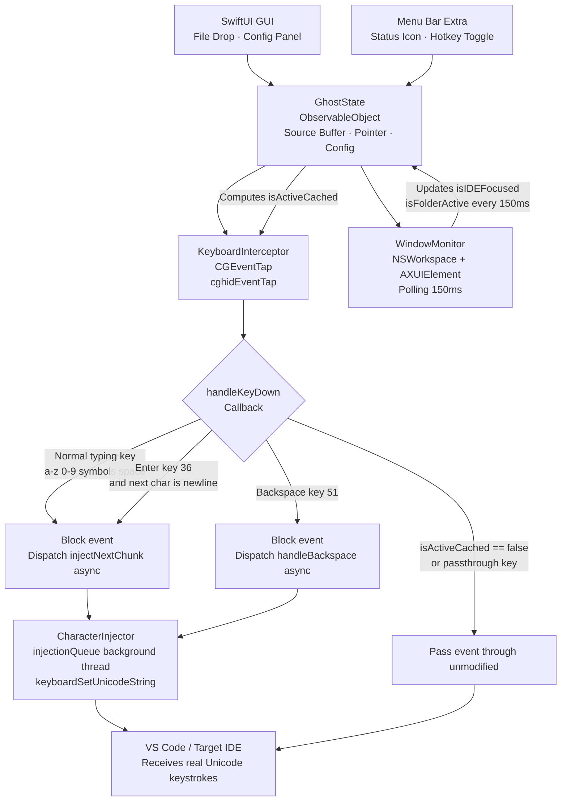

# Technical Requirement Document (TRD) — Ghost Coder
**Version:** 1.1 (MVP — macOS, Swift + SwiftUI)
**Status:** Ready for AI Agent Implementation

---

## 1. Technology Stack

| Layer | Technology | Rationale |
|---|---|---|
| **UI Framework** | Swift + SwiftUI | Native macOS, direct access to all AppKit/CoreGraphics APIs, no bridge overhead |
| **Core Engine** | Swift (CoreGraphics + AppKit) | CGEventTap lives in the same process as the UI — no IPC, no Platform Channels |
| **Build Target** | macOS 13+ Universal Binary (arm64 + x86_64) | M-series native + Intel Mac compatibility |
| **Distribution** | GitHub open source + `.dmg` via `create-dmg` | CGEventTap incompatible with App Store sandbox |
| **No Flutter** | — | Flutter adds Platform Channel complexity for no gain on a macOS-only MVP |
| **Windows (future)** | Evaluate at v2 | Either Flutter + C++ Platform Channel, or native C#/WPF. Do not design for this now. |

---

## 2. System Architecture



---

## 3. Component Specifications

### 3.1 GhostState (ObservableObject — Central State)

All components read from and write to this single source of truth. Lives for the app's lifetime.

```swift
// Models/GhostState.swift

import Foundation
import Combine

enum InputMode: String, CaseIterable, Identifiable {
    case character = "Character"
    case word = "Word"
    case line = "Line"
    var id: String { rawValue }
}

enum IDETarget: String, CaseIterable, Identifiable {
    case vsCode         = "VS Code"
    case vsCodeInsiders = "VS Code Insiders"
    case xcode          = "Xcode"
    case any            = "Any Application"

    var bundleID: String? {
        switch self {
        case .vsCode:         return "com.microsoft.VSCode"
        case .vsCodeInsiders: return "com.microsoft.VSCodeInsiders"
        case .xcode:          return "com.apple.dt.Xcode"
        case .any:            return nil
        }
    }

    var id: String { rawValue }
}

class GhostState: ObservableObject {

    // MARK: - Configuration (user-set, persisted)
    @Published var sourceCode: String = ""
    @Published var sourceFileName: String = ""
    @Published var ideTarget: IDETarget = .vsCode
    @Published var workspaceFolderPath: String = ""
    @Published var inputMode: InputMode = .character
    @Published var injectionDelayMs: Int = 12       // per-character delay for word/line mode

    // MARK: - Runtime State (not persisted)
    @Published var isGhostModeEnabled: Bool = false
    @Published var isIDEFocused: Bool = false
    @Published var isFolderScopeActive: Bool = true  // true when folder constraint passes
    @Published var currentIndex: Int = 0

    // MARK: - Injection History (for backspace undo)
    // Each entry = number of characters injected in one keypress
    var injectionHistory: [Int] = []

    // MARK: - Cached active flag (read by CGEventTap callback — must be thread-safe)
    // Updated on main thread by WindowMonitor. Read on tap thread (Bool is atomic on Apple platforms).
    private(set) var isActiveCached: Bool = false

    // MARK: - Computed Properties
    var progress: Double {
        guard !sourceCode.isEmpty else { return 0 }
        return Double(currentIndex) / Double(sourceCode.count)
    }

    var remainingCharCount: Int {
        max(0, sourceCode.count - currentIndex)
    }

    var isSourceLoaded: Bool {
        !sourceCode.isEmpty
    }

    // MARK: - State Updates
    func updateCachedActiveState() {
        // Called on main thread by WindowMonitor every 150ms
        isActiveCached = isGhostModeEnabled
            && isSourceLoaded
            && currentIndex < sourceCode.count
            && isIDEFocused
            && isFolderScopeActive
    }

    func loadSourceFile(url: URL) throws {
        let content = try String(contentsOf: url, encoding: .utf8)
        sourceCode = content
        sourceFileName = url.lastPathComponent
        reset()
    }

    func reset() {
        currentIndex = 0
        injectionHistory.removeAll()
    }

    // MARK: - Chunk Calculation (called on main/tap thread, fast — no IO)
    func getNextChunk() -> String {
        guard currentIndex < sourceCode.count else { return "" }

        let startOffset = sourceCode.index(sourceCode.startIndex, offsetBy: currentIndex)
        let remaining = sourceCode[startOffset...]

        switch inputMode {
        case .character:
            return String(remaining.prefix(1))

        case .word:
            // Read up to and including the next space or newline
            var result = ""
            for char in remaining {
                result.append(char)
                if char == " " || char == "\n" { break }
            }
            return result

        case .line:
            // Read up to and including the next newline
            var result = ""
            for char in remaining {
                result.append(char)
                if char == "\n" { break }
            }
            // If last line has no trailing newline, return remaining
            return result
        }
    }
}
```

---

### 3.2 KeyboardInterceptor (CGEventTap)

Runs on the main run loop. Intercepts keyDown events system-wide at `.cghidEventTap` level.

**Critical requirements:**
- Must call `AXIsProcessTrusted()` before creating the tap. If not trusted, prompt the user.
- A watchdog timer re-enables the tap every 5 seconds (macOS can disable unresponsive taps).
- The callback must return immediately — never sleep or do heavy work inside it.
- Injection is dispatched asynchronously to `injectionQueue`.

```swift
// Engine/KeyboardInterceptor.swift

import Cocoa
import CoreGraphics

class KeyboardInterceptor {
    private var eventTap: CFMachPort?
    private var runLoopSource: CFRunLoopSource?
    private var watchdogTimer: Timer?

    private let state: GhostState
    private let injector: CharacterInjector

    // Serial queue: one injection at a time; subsequent keypresses are blocked while injecting
    let injectionQueue = DispatchQueue(label: "com.ghostcoder.injection", qos: .userInteractive)
    var isInjecting: Bool = false  // read/written on main thread via DispatchQueue.main

    init(state: GhostState) {
        self.state = state
        self.injector = CharacterInjector(state: state)
    }

    // MARK: - Start / Stop

    func start() {
        guard checkAccessibilityPermission() else { return }

        let eventMask = CGEventMask(
            (1 << CGEventType.keyDown.rawValue)
        )

        eventTap = CGEvent.tapCreate(
            tap: .cghidEventTap,
            place: .headInsertEventTap,
            options: .defaultTap,
            eventsOfInterest: eventMask,
            callback: { proxy, type, event, refcon -> Unmanaged<CGEvent>? in
                // refcon is an unretained pointer to KeyboardInterceptor
                let interceptor = Unmanaged<KeyboardInterceptor>
                    .fromOpaque(refcon!)
                    .takeUnretainedValue()
                return interceptor.handleKeyDown(proxy: proxy, type: type, event: event)
            },
            refcon: Unmanaged.passUnretained(self).toOpaque()
        )

        guard let tap = eventTap else {
            print("Ghost Coder: Failed to create CGEventTap. Check Accessibility permissions.")
            return
        }

        runLoopSource = CFMachPortCreateRunLoopSource(kCFAllocatorDefault, tap, 0)
        CFRunLoopAddSource(CFRunLoopGetMain(), runLoopSource, .commonModes)
        CGEvent.tapEnable(tap: tap, enable: true)

        // Watchdog: macOS can silently disable taps that appear unresponsive
        watchdogTimer = Timer.scheduledTimer(withTimeInterval: 5.0, repeats: true) { [weak self] _ in
            guard let tap = self?.eventTap else { return }
            if !CGEvent.tapIsEnabled(tap: tap) {
                CGEvent.tapEnable(tap: tap, enable: true)
            }
        }
    }

    func stop() {
        watchdogTimer?.invalidate()
        watchdogTimer = nil
        if let tap = eventTap {
            CGEvent.tapEnable(tap: tap, enable: false)
        }
        if let source = runLoopSource {
            CFRunLoopRemoveSource(CFRunLoopGetMain(), source, .commonModes)
        }
        eventTap = nil
        runLoopSource = nil
    }

    // MARK: - Accessibility Permission

    @discardableResult
    func checkAccessibilityPermission() -> Bool {
        if AXIsProcessTrusted() { return true }
        // Prompt user to grant permission in System Settings → Privacy & Security → Accessibility
        let options = [kAXTrustedCheckOptionPrompt.takeRetainedValue() as String: true] as CFDictionary
        AXIsProcessTrustedWithOptions(options)
        return false
    }

    // MARK: - Event Handler (called on main thread, must return fast)

    private func handleKeyDown(
        proxy: CGEventTapProxy,
        type: CGEventType,
        event: CGEvent
    ) -> Unmanaged<CGEvent>? {

        // Check cached active state — pure Bool read, thread-safe
        guard state.isActiveCached else {
            return Unmanaged.passUnretained(event)  // pass through
        }

        // If currently injecting (word/line mode multi-char), block incoming key silently
        if isInjecting {
            return nil
        }

        let keyCode = Int(event.getIntegerValueField(.keyboardEventKeycode))
        let flags = event.flags

        // --- Rule 1: Any Cmd+key combination → always pass through ---
        if flags.contains(.maskCommand) {
            return Unmanaged.passUnretained(event)
        }

        // --- Rule 2: Explicit passthrough key codes ---
        let passthroughKeyCodes: Set<Int> = [
            123, 124, 125, 126,  // Arrow keys (Left, Right, Down, Up)
            53,                   // Escape
            48,                   // Tab (VS Code autocomplete navigation)
            117,                  // Forward Delete
            115, 119,             // Home, End
            116, 121,             // Page Up, Page Down
            // Function keys F1–F12
            122, 120, 99, 118, 96, 97, 98, 100, 101, 109, 103, 111
        ]
        if passthroughKeyCodes.contains(keyCode) {
            return Unmanaged.passUnretained(event)
        }

        // --- Rule 3: Backspace (keyCode 51) ---
        if keyCode == 51 {
            guard !state.injectionHistory.isEmpty else {
                return nil  // Nothing to undo; swallow the backspace
            }
            isInjecting = true
            injectionQueue.async { [weak self] in
                self?.injector.handleBackspace()
                DispatchQueue.main.async { self?.isInjecting = false }
            }
            return nil  // Block original backspace
        }

        // --- Rule 4: Enter/Return (keyCode 36) ---
        // Pass through Enter unless the next source character is \n
        if keyCode == 36 {
            let nextChar = state.sourceCode[
                state.sourceCode.index(state.sourceCode.startIndex, offsetBy: state.currentIndex)
            ]
            if nextChar != "\n" {
                return Unmanaged.passUnretained(event)
            }
            // Fall through to injection logic below — treat as a normal injection key
        }

        // --- Rule 5: Normal typing key → block and inject source characters ---
        let chunk = state.getNextChunk()
        guard !chunk.isEmpty else {
            return Unmanaged.passUnretained(event)  // Source exhausted; pass through
        }

        // Update state pointer and history on main thread
        let count = chunk.count
        state.injectionHistory.append(count)
        state.currentIndex += count
        state.updateCachedActiveState()

        // Inject asynchronously
        isInjecting = true
        injectionQueue.async { [weak self] in
            self?.injector.injectString(chunk)
            DispatchQueue.main.async { self?.isInjecting = false }
        }

        return nil  // Block the original keypress
    }
}
```

---

### 3.3 CharacterInjector

Performs the actual injection of characters into the frontmost application. Runs on the `injectionQueue` background thread.

**Key insight:** Use `CGEvent.keyboardSetUnicodeString` instead of virtual key codes. This bypasses keyboard layout differences entirely and works for every Unicode character including `{`, `}`, `[`, `]`, `;`, `//`, `=>`, emojis, etc.

```swift
// Engine/CharacterInjector.swift

import CoreGraphics

class CharacterInjector {
    private let state: GhostState

    init(state: GhostState) {
        self.state = state
    }

    // MARK: - Inject a string of characters (runs on injectionQueue)

    func injectString(_ text: String) {
        let delaySeconds = Double(state.injectionDelayMs) / 1000.0
        let isMultiChar = text.count > 1

        for char in text {
            switch char {
            case "\n":
                injectVirtualKey(keyCode: 36)  // Return key — preserves IDE auto-indent
            case "\t":
                injectVirtualKey(keyCode: 48)  // Tab key
            default:
                injectUnicodeCharacter(char)
            }

            if isMultiChar {
                // Small delay between characters in word/line mode so VS Code processes each
                Thread.sleep(forTimeInterval: delaySeconds)
            }
        }
    }

    // MARK: - Unicode Character Injection (layout-independent)

    private func injectUnicodeCharacter(_ char: Character) {
        // Convert to UTF-16 UniChar array (handles BMP and supplementary planes)
        var utf16Units = Array(char.utf16)

        let source = CGEventSource(stateID: .combinedSessionState)

        let keyDown = CGEvent(keyboardEventSource: source, virtualKey: 0, keyDown: true)
        let keyUp   = CGEvent(keyboardEventSource: source, virtualKey: 0, keyDown: false)

        keyDown?.keyboardSetUnicodeString(stringLength: utf16Units.count, unicodeString: &utf16Units)
        keyUp?.keyboardSetUnicodeString(stringLength: utf16Units.count, unicodeString: &utf16Units)

        keyDown?.post(tap: .cghidEventTap)
        keyUp?.post(tap: .cghidEventTap)
    }

    // MARK: - Virtual Key Injection (for Return, Tab, Backspace)

    func injectVirtualKey(keyCode: CGKeyCode) {
        let source = CGEventSource(stateID: .combinedSessionState)
        CGEvent(keyboardEventSource: source, virtualKey: keyCode, keyDown: true)?.post(tap: .cghidEventTap)
        CGEvent(keyboardEventSource: source, virtualKey: keyCode, keyDown: false)?.post(tap: .cghidEventTap)
    }

    // MARK: - Backspace Undo

    func handleBackspace() {
        guard let lastChunkSize = DispatchQueue.main.sync(execute: { () -> Int? in
            state.injectionHistory.popLast()
        }) else { return }

        // Update the index on the main thread
        DispatchQueue.main.async {
            self.state.currentIndex -= lastChunkSize
            self.state.updateCachedActiveState()
        }

        // Inject N backspace events to delete the injected characters from the IDE
        for i in 0..<lastChunkSize {
            injectVirtualKey(keyCode: 51)  // Backspace
            if lastChunkSize > 1 && i < lastChunkSize - 1 {
                Thread.sleep(forTimeInterval: 0.010)  // 10ms between backspaces
            }
        }
    }
}
```

---

### 3.4 WindowMonitor

Polls every 150ms to determine whether the target IDE is frontmost and whether the folder scope constraint passes. Updates `GhostState` on the main thread.

```swift
// Engine/WindowMonitor.swift

import AppKit

class WindowMonitor {
    private let state: GhostState
    private var timer: Timer?

    init(state: GhostState) {
        self.state = state
    }

    func start() {
        timer = Timer.scheduledTimer(withTimeInterval: 0.15, repeats: true) { [weak self] _ in
            self?.check()
        }
    }

    func stop() {
        timer?.invalidate()
        timer = nil
    }

    private func check() {
        // Must run on main thread (NSWorkspace + UI updates)
        guard Thread.isMainThread else {
            DispatchQueue.main.async { self.check() }
            return
        }

        guard let frontApp = NSWorkspace.shared.frontmostApplication else {
            state.isIDEFocused = false
            state.isFolderScopeActive = true
            state.updateCachedActiveState()
            return
        }

        // Check if target IDE is focused
        let isFocused: Bool
        if let targetBundleID = state.ideTarget.bundleID {
            isFocused = frontApp.bundleIdentifier == targetBundleID
        } else {
            // "Any Application" mode — always focused if something is frontmost
            isFocused = true
        }

        // Check folder scope constraint
        var isFolderActive = true
        if isFocused && !state.workspaceFolderPath.isEmpty {
            isFolderActive = checkFolderScope(app: frontApp)
        }

        state.isIDEFocused = isFocused
        state.isFolderScopeActive = isFolderActive
        state.updateCachedActiveState()
    }

    // Check if the IDE's frontmost window title references the configured folder
    private func checkFolderScope(app: NSRunningApplication) -> Bool {
        let axApp = AXUIElementCreateApplication(app.processIdentifier)

        var windowsRef: AnyObject?
        guard AXUIElementCopyAttributeValue(axApp, kAXWindowsAttribute as CFString, &windowsRef) == .success,
              let windows = windowsRef as? [AXUIElement],
              let frontWindow = windows.first else {
            return false
        }

        var titleRef: AnyObject?
        guard AXUIElementCopyAttributeValue(frontWindow, kAXTitleAttribute as CFString, &titleRef) == .success,
              let windowTitle = titleRef as? String else {
            return false
        }

        // Match on the last path component of workspaceFolderPath
        // VS Code title format: "filename — foldername — Visual Studio Code"
        let folderName = URL(fileURLWithPath: state.workspaceFolderPath).lastPathComponent
        return windowTitle.contains(folderName)
    }
}
```

---

### 3.5 GlobalHotkey (Cmd + Shift + G)

Registers a global key monitor to detect the toggle hotkey even when Ghost Coder's window is hidden.

```swift
// HotKey/GlobalHotkey.swift

import AppKit

class GlobalHotkey {
    private var globalMonitor: Any?
    private var localMonitor: Any?
    private let state: GhostState
    private let interceptor: KeyboardInterceptor

    init(state: GhostState, interceptor: KeyboardInterceptor) {
        self.state = state
        self.interceptor = interceptor
    }

    func register() {
        // Global monitor: fires even when app is not focused
        globalMonitor = NSEvent.addGlobalMonitorForEvents(matching: .keyDown) { [weak self] event in
            self?.handleEvent(event)
        }
        // Local monitor: fires when app's own window is focused
        localMonitor = NSEvent.addLocalMonitorForEvents(matching: .keyDown) { [weak self] event in
            self?.handleEvent(event)
            return event
        }
    }

    func unregister() {
        if let gm = globalMonitor { NSEvent.removeMonitor(gm) }
        if let lm = localMonitor  { NSEvent.removeMonitor(lm) }
    }

    private func handleEvent(_ event: NSEvent) {
        // Cmd + Shift + G  (keyCode 5 = 'g')
        guard event.modifierFlags.contains([.command, .shift]),
              event.keyCode == 5 else { return }

        DispatchQueue.main.async { [weak self] in
            guard let self = self else { return }
            self.state.isGhostModeEnabled.toggle()
            self.state.updateCachedActiveState()

            if self.state.isGhostModeEnabled {
                // Hide main window when Ghost Mode activates
                NSApp.windows.filter { $0.identifier?.rawValue == "mainWindow" }
                    .forEach { $0.orderOut(nil) }
            } else {
                // Show main window when Ghost Mode deactivates
                NSApp.windows.filter { $0.identifier?.rawValue == "mainWindow" }
                    .forEach { $0.makeKeyAndOrderFront(nil) }
            }
        }
    }
}
```

---

### 3.6 SwiftUI App Entry Point

```swift
// GhostCoderApp.swift

import SwiftUI

@main
struct GhostCoderApp: App {
    @StateObject private var state = GhostState()
    private var interceptor: KeyboardInterceptor
    private var windowMonitor: WindowMonitor
    private var hotkey: GlobalHotkey

    init() {
        let s = GhostState()
        let i = KeyboardInterceptor(state: s)
        let w = WindowMonitor(state: s)
        let h = GlobalHotkey(state: s, interceptor: i)
        _state = StateObject(wrappedValue: s)
        interceptor = i
        windowMonitor = w
        hotkey = h
        i.start()
        w.start()
        h.register()
    }

    var body: some Scene {
        // Menu bar — no Dock icon (LSUIElement = YES in Info.plist)
        MenuBarExtra {
            MenuBarView(state: state)
        } label: {
            MenuBarIcon(state: state)
        }
        .menuBarExtraStyle(.menu)

        Window("Ghost Coder", id: "mainWindow") {
            ContentView(state: state)
        }
        .windowResizability(.contentSize)
        .defaultPosition(.center)
    }
}
```

---

### 3.7 SwiftUI View Structure

```
ContentView
├── SourceFileSection
│   ├── DropZone           — accepts file drop, calls state.loadSourceFile(url:)
│   ├── FileInfo           — shows fileName, char count, line count
│   └── ResetButton        — calls state.reset()
│
├── TargetSection
│   ├── IDEPicker          — Picker bound to state.ideTarget
│   └── FolderPathField    — TextField + folder picker button bound to state.workspaceFolderPath
│
├── ModeSection
│   ├── InputModePicker    — Picker (segmented) bound to state.inputMode
│   └── DelaySlider        — shown only when mode == .word or .line
│                            bound to state.injectionDelayMs, range 5–80
│
├── ProgressSection
│   ├── ProgressBar        — value: state.progress
│   └── CharCountLabel     — "\(state.currentIndex) / \(state.sourceCode.count) characters"
│
└── StatusPill
    └── Shows "Active" (green) / "Paused" (orange) / "Inactive" (grey)
        based on state.isActiveCached, state.isGhostModeEnabled

MenuBarView (dropdown menu)
├── Text: "Ghost Mode: Active" / "Paused" / "Inactive"
├── Button: Toggle Ghost Mode (⌘⇧G)
├── Button: Show Window
└── Button: Quit
```

---

## 4. Info.plist Required Entries

```xml
<!-- Hide from Dock — required for menu bar app -->
<key>LSUIElement</key>
<true/>

<!-- Required description for Accessibility permission prompt -->
<key>NSAppleEventsUsageDescription</key>
<string>Ghost Coder requires Accessibility access to intercept and inject keyboard events.</string>

<!-- Required by CGEventTap on macOS 13+ -->
<key>com.apple.security.temporary-exception.mach-lookup.global-name</key>
<array>
    <string>com.apple.coreservices.appleevents</string>
</array>
```

---

## 5. Xcode Project Settings

| Setting | Value |
|---|---|
| Deployment Target | macOS 13.0 |
| Architectures | `arm64 x86_64` (Universal) |
| Signing | Personal Team or Apple Developer Program |
| Sandboxing (Entitlements) | **Disabled** — CGEventTap requires unsandboxed execution |
| App Category | Developer Tools |
| Bundle Identifier | `com.ghostcoder.app` |

**Hardened Runtime Entitlements** (for Notarization):
```xml
<key>com.apple.security.automation.apple-events</key>
<true/>
<!-- Accessibility via CGEventTap does not need a special entitlement but requires
     the user to grant access in System Settings → Privacy & Security → Accessibility -->
```

---

## 6. Key Technical Constraints & Mitigations

| Constraint | Problem | Mitigation in This TRD |
|---|---|---|
| **CGEventTap disabled by macOS** | macOS silently disables taps that appear slow | Watchdog timer every 5s re-enables the tap |
| **Tap callback must be fast** | Sleeping inside callback blocks the event queue system-wide | All injection dispatched to `injectionQueue` background thread; callback returns instantly |
| **Unicode > U+FFFF (emoji, supplementary)** | Single character may need two UTF-16 units (surrogate pair) | `char.utf16` handles this; UniChar array passed to `keyboardSetUnicodeString` |
| **Concurrent keypresses during injection** | User types next key before word/line injection finishes | `isInjecting` flag; while true, all intercepted keys are swallowed (return nil) |
| **VS Code folder scope detection** | VS Code window title only shows folder name, not full path | Match only on `URL.lastPathComponent` of the configured folder path |
| **Thread safety on GhostState** | CGEventTap callback reads state on a non-main thread | `isActiveCached` is a plain `Bool` (not @Published); updated atomically on main thread |
| **Accessibility permission not granted** | CGEventTap returns nil silently | `checkAccessibilityPermission()` prompts user via `AXIsProcessTrustedWithOptions` on first launch |

---

## 7. Project File Structure

```
GhostCoder.xcodeproj/
GhostCoder/
├── GhostCoderApp.swift            # @main, MenuBarExtra, Window scene
├── Models/
│   └── GhostState.swift           # ObservableObject — all state
├── Engine/
│   ├── KeyboardInterceptor.swift  # CGEventTap setup + event routing
│   ├── CharacterInjector.swift    # Unicode + virtual key injection
│   └── WindowMonitor.swift        # NSWorkspace + AXUIElement polling
├── HotKey/
│   └── GlobalHotkey.swift         # Cmd+Shift+G global monitor
├── Views/
│   ├── ContentView.swift          # Main window layout
│   ├── SourceFileSection.swift    # Dropzone + file info
│   ├── TargetSection.swift        # IDE picker + folder path
│   ├── ModeSection.swift          # Input mode + delay slider
│   ├── ProgressSection.swift      # Progress bar + char count
│   ├── StatusPill.swift           # Active/Paused/Inactive badge
│   ├── MenuBarView.swift          # Dropdown menu content
│   └── MenuBarIcon.swift          # Dynamic menu bar icon
├── Assets.xcassets/
│   ├── AppIcon.appiconset/
│   └── MenuBarIcons/              # circle.fill variants (grey/green/orange)
├── GhostCoder.entitlements        # Hardened runtime: apple-events
└── Info.plist                     # LSUIElement + NSAppleEventsUsageDescription
```

---

## 8. Build & Distribution Commands

```bash
# 1. Archive universal binary
xcodebuild archive \
  -scheme GhostCoder \
  -configuration Release \
  -archivePath ./build/GhostCoder.xcarchive \
  ARCHS="arm64 x86_64" \
  ONLY_ACTIVE_ARCH=NO

# 2. Export .app from archive
xcodebuild -exportArchive \
  -archivePath ./build/GhostCoder.xcarchive \
  -exportPath ./build/export \
  -exportOptionsPlist ExportOptions.plist

# 3. Create .dmg (requires: brew install create-dmg)
create-dmg \
  --volname "Ghost Coder" \
  --window-size 560 340 \
  --icon-size 100 \
  --icon "GhostCoder.app" 140 170 \
  --app-drop-link 420 170 \
  "GhostCoder.dmg" \
  "./build/export/GhostCoder.app"

# 4. Notarize (requires Apple Developer account)
xcrun notarytool submit GhostCoder.dmg \
  --apple-id "your@email.com" \
  --team-id "YOURTEAMID" \
  --password "app-specific-password" \
  --wait

# 5. Staple notarization ticket to DMG
xcrun stapler staple GhostCoder.dmg
```

**ExportOptions.plist** (place in project root):
```xml
<?xml version="1.0" encoding="UTF-8"?>
<!DOCTYPE plist PUBLIC "-//Apple//DTD PLIST 1.0//EN" "...">
<plist version="1.0">
<dict>
    <key>method</key>
    <string>developer-id</string>
    <key>hardcodedRuntime</key>
    <true/>
</dict>
</plist>
```

---

## 9. Virtual Key Code Reference

| Key | Virtual Key Code | Used For |
|---|---|---|
| Return / Enter | 36 | Injecting `\n` from source |
| Tab | 48 | Injecting `\t` from source |
| Backspace | 51 | Undo injection |
| Escape | 53 | Always passthrough |
| Arrow Left | 123 | Always passthrough |
| Arrow Right | 124 | Always passthrough |
| Arrow Down | 125 | Always passthrough |
| Arrow Up | 126 | Always passthrough |
| 'g' (for Cmd+Shift+G) | 5 | Hotkey detection |

All other characters → inject via `keyboardSetUnicodeString` (no virtual key code needed).
